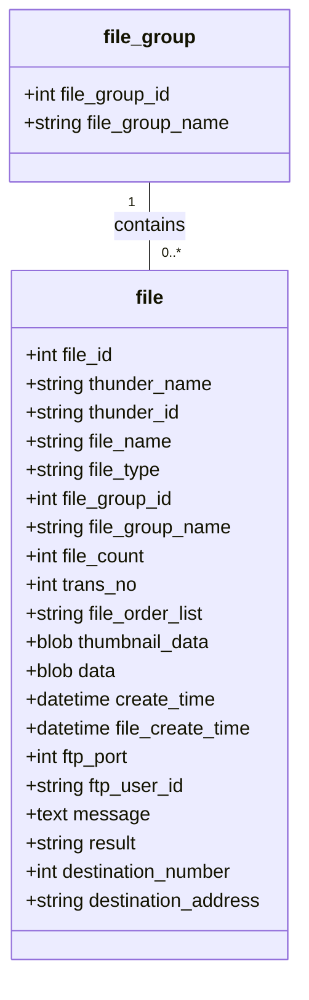

# データベース設計

この文書は、データベーステーブルを説明する設計書です。

## ファイルテーブル設計

### テーブル: `file`

| カラム名              | 型         | 説明                   |
| --------------------- | ---------- | ---------------------- |
| `file_id`             | `int`      | ファイル固有 ID        |
| `thunder_name`        | `string`   | サンダーネーム         |
| `thunder_id`          | `string`   | サンダー ID            |
| `file_name`           | `string`   | ファイル名             |
| `file_type`           | `string`   | ファイルタイプ         |
| `file_group_id`       | `int`      | ファイルグループ ID    |
| `file_group_name`     | `string`   | ファイルグループ名     |
| `file_count`          | `int`      | ファイル数             |
| `trans_no`            | `int`      | トランザクション番号   |
| `file_order_list`     | `string`   | ファイルオーダーリスト |
| `thumbnail_data`      | `blob`     | サムネイルデータ       |
| `data`                | `blob`     | データ                 |
| `create_time`         | `datetime` | 作成時間               |
| `file_create_time`    | `datetime` | ファイル作成時間       |
| `ftp_port`            | `int`      | FTP ポート             |
| `ftp_user_id`         | `string`   | FTP ユーザー ID        |
| `message`             | `text`     | メッセージ             |
| `result`              | `string`   | 結果                   |
| `destination_number`  | `int`      | 目的地番号             |
| `destination_address` | `string`   | 目的地住所             |

---

## ファイルテーブル関係

